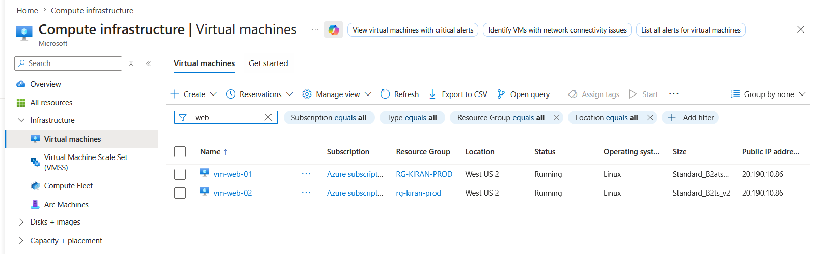
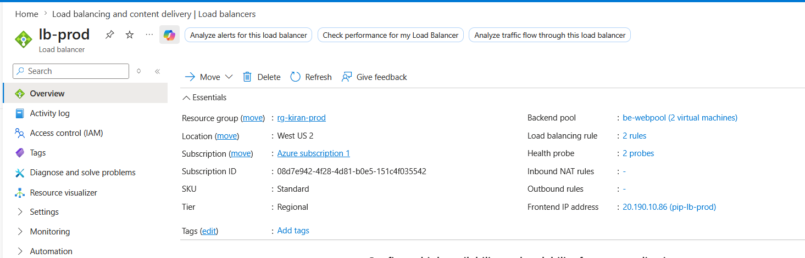
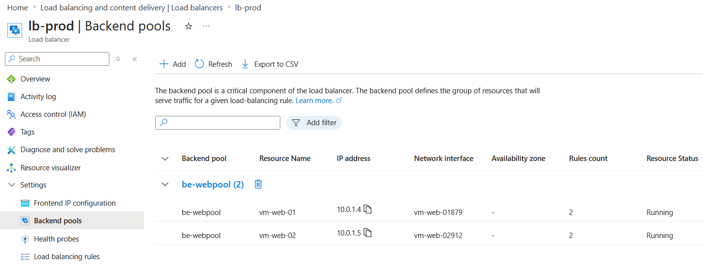
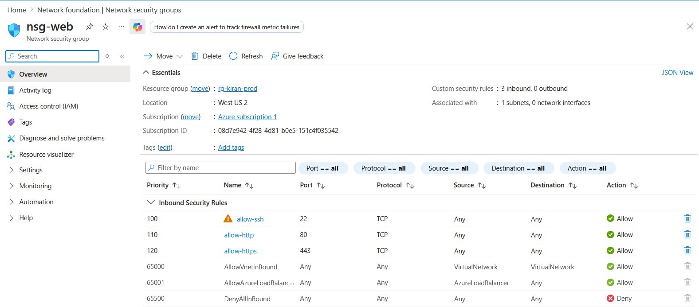

# Azure Linux High Availability Infrastructure

## Overview

Built a highly available Linux infrastructure environment in Microsoft Azure using Ubuntu virtual machines, Azure Load Balancer, NSG-based traffic filtering, Nginx web hosting, HTTPS, and SSH hardening.

This project was designed to simulate real-world Linux administration and cloud infrastructure support scenarios including connectivity failures, service outages, and infrastructure troubleshooting.

---

## Architecture

Internet  
↓  
Azure Load Balancer  
↓  
vm-web-01 (Primary Web Node)  
vm-web-02 (Secondary Web Node)

---

## Infrastructure Components

- Ubuntu 24.04 Linux Virtual Machines
- Azure Virtual Network (VNet)
- Azure Network Security Groups (NSG)
- Azure Load Balancer
- Nginx Web Server
- HTTPS with Certbot SSL
- SSH Key Authentication
- Azure Public IP Configuration
- Azure Monitoring and VM Management

---

## Features Implemented

- High availability web deployment
- Load balancer backend pool configuration
- Health probe validation
- HTTPS-enabled custom domain
- SSH key-based authentication
- NSG inbound traffic filtering
- Static private IP configuration
- Multi-VM infrastructure deployment
- Linux administration and troubleshooting practice

---

## Troubleshooting Scenarios Practiced

### SSH Access Failures
- Invalid NSG rules
- Incorrect SSH configuration
- Public IP removal scenarios
- SSH authentication troubleshooting

### Web Service Issues
- Nginx service failures
- Port 80/443 accessibility issues
- HTTPS certificate validation issues
- Backend node validation

### Infrastructure Troubleshooting
- DNS resolution failures
- Disk utilization issues
- High CPU utilization
- VM connectivity validation
- Load balancer traffic validation

---

## Linux Commands Used

```bash
df -h
du -sh /*
top
ps -ef
journalctl -xe
systemctl status nginx
systemctl restart nginx
ss -tulnp
curl
dig
nslookup
```

---

## Security Configuration

- SSH key authentication enabled
- Password authentication disabled
- NSG rules restricted to required ports
- HTTPS enforced using SSL certificates
- Root login hardening practiced

---

## Live Project

Website:
https://azure.kirantechlab.online

---

## Skills Demonstrated

- Linux System Administration
- Azure Infrastructure Administration
- SSH Troubleshooting
- Network Troubleshooting
- Nginx Administration
- HTTPS / SSL Configuration
- Infrastructure Monitoring
- Cloud VM Administration
- Production-style Incident Troubleshooting

  ---

## Infrastructure Screenshots

### Azure VM Overview


### Azure Load Balancer


### Azure Backend Pool


### NSG Inbound Rules


### Health Probes

